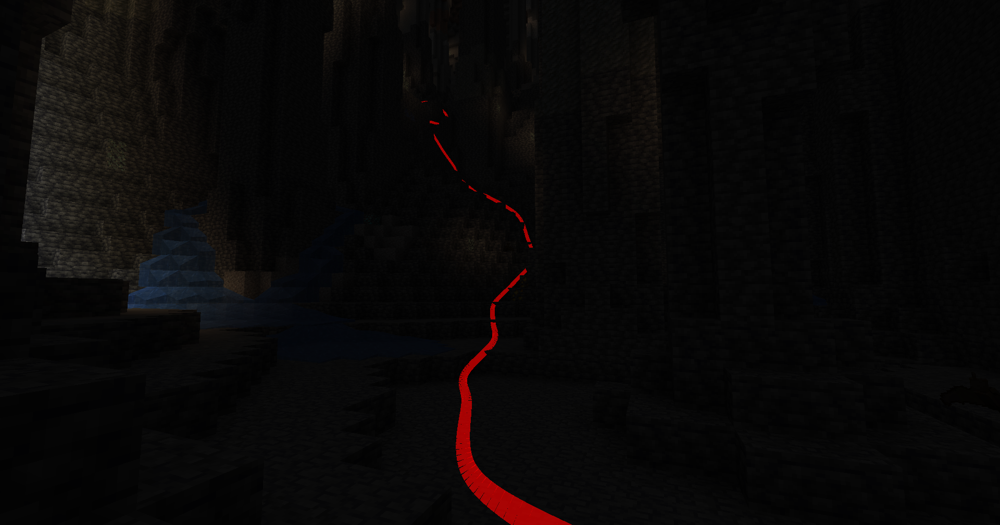

# PathTracker

<figure><figcaption><p>PathTracker Example</p></figcaption></figure>

https://github.com/user-attachments/assets/c405e97b-5d06-47fe-81c7-416d9eb90bcb

**PathTracker** is a Minecraft Fabric mod that enhances your exploration experience by visually tracking your movements across different dimensions. It overlays translucent colored lines behind your player, allowing you to see the paths you've taken. Whether you're navigating the Overworld, exploring the Nether, or venturing into the End, PathTracker ensures you never lose your way.

## Features

- **Multi-Dimension Tracking**: Seamlessly track your paths across the Overworld, Nether, and End with separate tracking data for each dimension.
- **Multiple Tracking Sessions**: Create, list, and switch between multiple tracking sessions to manage different exploration endeavors.
- **Customizable Overlay Colors**: Choose your preferred color for the tracking lines using hexadecimal color codes.
- **Depth Override**: Toggle depth testing to control whether tracking lines are rendered behind or on top of opaque blocks.
- **Manual Save Command**: Save your tracked paths at any time without needing to exit the game.
- **Key Bindings**: Quickly enable or disable tracking and rendering using customizable key bindings.

## Installation

1. **Prerequisites**:
   - **Minecraft Java Edition**.
   - **Fabric Loader** installed for your Minecraft version.
   - **Fabric API** installed.

2. **Download PathTracker**:
   - Obtain the latest `PathTracker.jar` file from the GitHub releases.

3. **Install the Mod**:
   - Navigate to your Minecraft `mods` directory:
     - **Windows**: `%appdata%\.minecraft\mods`
     - **macOS**: `~/Library/Application Support/minecraft/mods`
     - **Linux**: `~/.minecraft/mods`
   - Place the `PathTracker.jar` file into the `mods` folder.

4. **Launch Minecraft**:
   - Start Minecraft using the Fabric profile.
   - Ensure that the mod is loaded by checking the Mods section in the main menu.

## Usage

Once installed, PathTracker offers several commands and key bindings to manage tracking and rendering.

### Key Bindings

- **Toggle Tracking**:
  - **Default Key**: `K`
  - **Function**: Enable or disable path tracking.

- **Toggle Rendering**:
  - **Default Key**: `L`
  - **Function**: Show or hide the tracking lines.

### Commands

All commands are prefixed with `/pathtracker`.

#### 1. **Tracking Control**

- **Enable Tracking**:

`/pathtracker track on`

*Enables path tracking.*

- **Disable Tracking**:

`/pathtracker track off`

*Disables path tracking.*

#### 2. **Rendering Control**

- **Enable Rendering**:

`/pathtracker render on`

*Shows the tracking lines in the world.*

- **Disable Rendering**:

`/pathtracker render off`

*Hides the tracking lines.*

#### 3. **Color Customization**

- **Set Line Color**:

`/pathtracker color <hex>`

*Changes the color of the tracking lines.*

- **Parameters**:
  - `<hex>`: Hexadecimal color code (e.g., `FF0000` for red or `00FF00` for green).

- **Example**:
  `/pathtracker color 00FF00`
  
  *Sets the tracking lines to green.*

#### 4. **Save Path Data**

- **Manual Save**:

`/pathtracker save`

*Saves all tracked path data across all dimensions and sessions.*

#### 5. **Session Management**

- **List Current Session**:

`/pathtracker session current`

*Displays the current tracking session.*

- **List All Sessions**:

`/pathtracker session list`

*Shows all available tracking sessions.*

- **Create New Session**:

`/pathtracker session create <name>`

*Creates a new tracking session.*

- **Parameters**:
  - `<name>`: Name of the new session.

- **Example**:
  ```
  /pathtracker session create Exploration1
  ```

- **Switch Session**:

`/pathtracker session switch <name>`

*Switches to an existing tracking session.*

- **Parameters**:
  - `<name>`: Name of the session to switch to.

- **Example**:
  ```
  /pathtracker session switch Exploration1
  ```

#### 6. **Depth Override Control**

- **Enable Depth Override**:

`/pathtracker depth on`

*Renders tracking lines on top of all blocks, ignoring depth.*

- **Disable Depth Override**:

`/pathtracker depth off`

*Respects depth, allowing lines to be occluded by opaque blocks.*

#### 7. **Transparency**

- **Set Transparency**

`/pathtracker transparency <value>`

*Set the transparency to value/10000.*

- **Parameters**:
  - `<value>`: percentage value of transparency to set (each 1 equals to 0.0001%)

- **Example**:
  ```
  /pathtracker transparency 5000
  ```


#### 8. **Mode Option**

- **Mode: DEFAULT or GROUPED**

`/pathtracker mode <mode>`

*Set the mode to DEFAULT or GROUPED.*

- **Parameters**:
  - `<mode>`: mode to set (DEFAULT or GROUPED)

- **Example**:
  ```
  /pathtracker mode GROUPED
  ```

#### 9. **Thickness Size**

- **Set Thickness**

`/pathtracker thickness <value>`

*Set the thickness of the strip (0 to 100).*

- **Parameters**:
  - `<value>`: thickness value to set

- **Example**:
  ```
  /pathtracker thickness 50
  ```

#### 10. **Render Distance**

- **Render Distance**

`/pathtracker renderdistance <value>`

*Set the render distance of the strip (0 to 100).*

- **Parameters**:
  - `<value>`: render distance value to set

- **Example**:
  ```
  /pathtracker renderdistance 512
  ```

## Configuration

PathTracker stores its data within the Minecraft configuration directory, organizing tracking data per session and dimension. The `PathStorageSessions` class manages multiple sessions, each with its own set of tracked positions across different dimensions.

### Data Structure

- **sessions.json**: Lists all available tracking sessions.
- **settings.json**: Stores the current session and line color settings.
- **<session_name>**: Contains path data files for each dimension within the session.
```
CONFIG
├───fabric
└───pathtracer
    │   sessions.json
    │   settings.json
    │
    ├───default
    │       path_data_New World_minecraft_overworld.json
    │       path_data_New World_minecraft_the_end.json
    │       path_data_New World_minecraft_the_nether.json
    │
    └───SESSION_NAME
            path_data_WORLD_NAME_minecraft_overworld.json
            path_data_WORLD_NAME_minecraft_the_end.json
            path_data_WORLD_NAME_minecraft_the_nether.json
```

Multiple worlds can share the same session name, but will be placed in different files.


## Contributing

Contributions are welcome! If you'd like to enhance PathTracker, please follow these guidelines:

1. **Fork the Repository**: Create a personal copy of the project.
2. **Create a Feature Branch**: Develop your feature or fix in a separate branch.
3. **Commit Your Changes**: Write clear and concise commit messages.
4. **Submit a Pull Request**: Describe your changes and the problem they solve.

## Support

If you encounter any issues or have suggestions for improvements, feel free to open an issue on this GitHub Repository.

## License

PathTracker is released under the [MIT License](LICENSE).

---

**Note**: Always backup your game data before installing or updating mods to prevent potential data loss.
